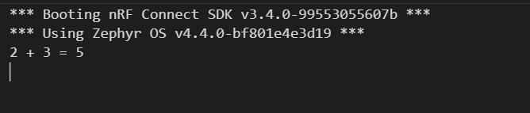
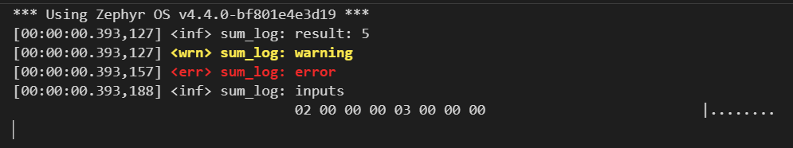

# ESE5180: Lab 0 Zephyr

| Team Member Name | Email Address                |
| ---------------- | ---------------------------- |
| Bowen Wang       | wangbw@engineering.upenn.edu |

**GitHub Repository URL: https://github.com/Bowen-wang-sps/ese5180-lab0-zephyr.git**

## (3.1) Build and Flash using only west commands and not the GUI. Show the terminal prints by embedding ascreenshot in your README.m

(6.1) Take screenshots of console output for both builds:
● CONFIG_SUM_PRINT=y → result printed with printk().
● CONFIG_SUM_LOG=y → result printed with the Logger (include hexdump).

